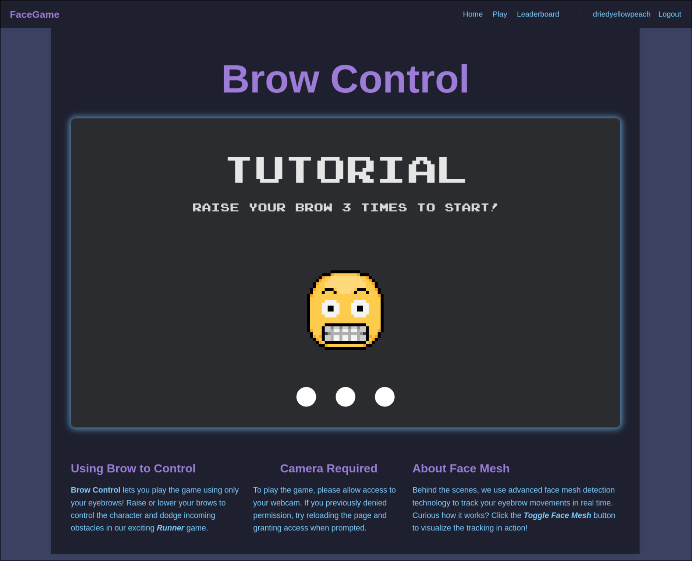

# Facial Expression Control Game and Leaderboard

**Authors:** Neil Wang, Aniket Nandi

**Class:** [CS5610 Web Development](https://northeastern.instructure.com/courses/245751)

**Project Objective:** Build a web platform that serves a Flappy Bird-style game controlled by facial expressions using real-time face detection via WebAssembly. Players use their webcam and eyebrow movements to control the game character -- no keyboard needed. The platform includes user accounts, a global leaderboard with pagination, and user profiles with customizable avatars.

Inspired by [Flappy Bird](https://flappybird.io/) and built upon our [project 1 prototype](https://driedyellowpeach.github.io/cs5610-web-dev/project-1-home-page/work.html).

## Screenshot



## Features

- **Facial expression game control** -- raise and lower your eyebrows to steer the character, detected in real-time via MediaPipe FaceLandmarker (WASM).
- **WebAssembly game engine** -- a Flappy Bird-style game compiled from Rust to WASM for near-native browser performance.
- **User authentication** -- register and login with email validation, bcrypt password hashing, and JWT sessions.
- **Global leaderboard** -- paginated rankings with score highlighting, deep-link support (`?page=N&highlight=scoreId`), and browser history navigation.
- **User profiles** -- public profiles with username, avatar, membership date, and top scores. Owners can edit their username and pick from preset avatars.
- **Responsive design** -- mobile-friendly layout with hamburger navigation.

## Tech Stack

| Layer          | Technology                           |
| -------------- | ------------------------------------ |
| Backend        | Node.js, Express.js                  |
| Database       | MongoDB (native driver, no Mongoose) |
| Frontend       | Vanilla ES6 JavaScript, HTML5, CSS3  |
| Game Engine    | Rust compiled to WebAssembly         |
| Face Detection | MediaPipe FaceLandmarker (WASM)      |
| Authentication | JWT (`jsonwebtoken`), `bcrypt`       |
| Deployment     | Docker, Render, MongoDB Atlas        |

## Prerequisites

- [Docker](https://docs.docker.com/get-docker/)

## Quick Start

Start everything (MongoDB + Node server) with one command:

```bash
docker compose up -d
```

Open http://localhost:3000

### Development with File Watching

To auto-sync file changes into the running container:

```bash
docker compose watch
```

This watches `server/` and `public/` for changes and syncs them into the container automatically.

### Stop

```bash
docker compose down
```

Stop and delete all data:

```bash
docker compose down -v
```

### Run Without Docker (alternative)

If you prefer running Node locally:

```bash
docker compose up -d mongo    # start only MongoDB
npm install
npm run dev                   # start Node server with auto-reload
```

## Project Structure

```
cs5610-project2/
├── server/                 # Backend
│   ├── index.js            # Express entry point
│   ├── seed.js             # Database seeder (sample data)
│   ├── db/connection.js    # MongoDB connection
│   ├── middleware/auth.js   # JWT auth middleware
│   └── routes/
│       ├── auth.js         # /api/auth   (register, login, me)
│       ├── scores.js       # /api/scores (submit, leaderboard, rank)
│       └── users.js        # /api/users  (profile, update, user scores)
├── public/                 # Frontend (served as static files)
│   ├── index.html          # Home page
│   ├── login.html          # Login / Register
│   ├── leaderboard.html    # Leaderboard with pagination
│   ├── profile.html        # User profile
│   ├── game/               # Game page
│   │   ├── index.html      # Game UI (canvas, webcam, controls)
│   │   ├── style.css       # Game-specific styles
│   │   ├── scripts/        # Game JS (WASM loader, MediaPipe)
│   │   └── third-party/    # MediaPipe WASM model files
│   ├── css/style.css       # Global styles
│   ├── js/                 # Shared client-side JavaScript
│   │   ├── api.js          # Fetch wrapper, JWT helpers
│   │   ├── auth.js         # Login/register logic
│   │   ├── main.js         # Home page (top-5 scores)
│   │   ├── leaderboard.js  # Leaderboard pagination
│   │   ├── profile.js      # Profile view/edit
│   │   └── nav.js          # Dynamic navigation bar
│   └── assets/             # Avatars (SVG)
├── doc/                    # Documentation
│   ├── design.md           # Design document (personas, user stories)
│   ├── mockups.html        # Wireframe mockups for all pages
│   ├── api.md              # API reference
│   ├── frontend.md         # Frontend guide
│   ├── setup.md            # Setup guide
│   └── deployment.md       # Deployment guide
├── Dockerfile
├── docker-compose.yml
├── package.json
└── idea.md                 # Original project idea
```

## API Endpoints

| Method | Endpoint                  | Auth     | Description                           |
| ------ | ------------------------- | -------- | ------------------------------------- |
| POST   | `/api/auth/register`      | No       | Register a new account                |
| POST   | `/api/auth/login`         | No       | Login                                 |
| GET    | `/api/auth/me`            | Required | Get current user info                 |
| POST   | `/api/scores`             | Required | Submit a score                        |
| GET    | `/api/scores/me`          | Required | Get my scores                         |
| GET    | `/api/scores/leaderboard` | No       | Get top scores (paginated)            |
| GET    | `/api/scores/rank/:id`    | No       | Get rank and page of a specific score |
| GET    | `/api/users/:id`          | No       | Get user profile                      |
| PUT    | `/api/users/me`           | Required | Update own profile                    |
| GET    | `/api/users/:id/scores`   | No       | Get a user's top scores               |

See [doc/api.md](doc/api.md) for full request/response formats and examples.

## Documentation

- [Design Document](doc/design.md) -- project description, user personas, user stories, mockup references
- [Design Mockups](doc/mockups.html) -- wireframe layouts for every page (open in browser)
- [API Reference](doc/api.md) -- backend endpoints, request/response formats, database schema
- [Frontend Guide](doc/frontend.md) -- pages, shared JS modules, styling, assets
- [Setup Guide](doc/setup.md) -- installation, environment variables, all commands
- [Deployment Guide](doc/deployment.md) -- Docker deployment to cloud with Nginx proxy

## Team

- **Neil Wang (Runze Wang)** -- Game page, WebAssembly game, score submission, game-related backend APIs
- **Aniket Nandi** -- Leaderboard page, user profile page, related backend APIs
