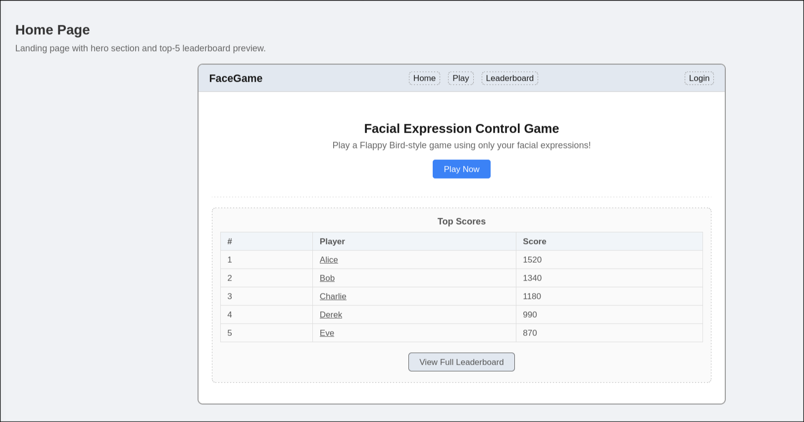
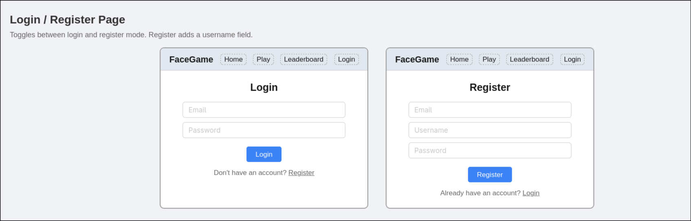
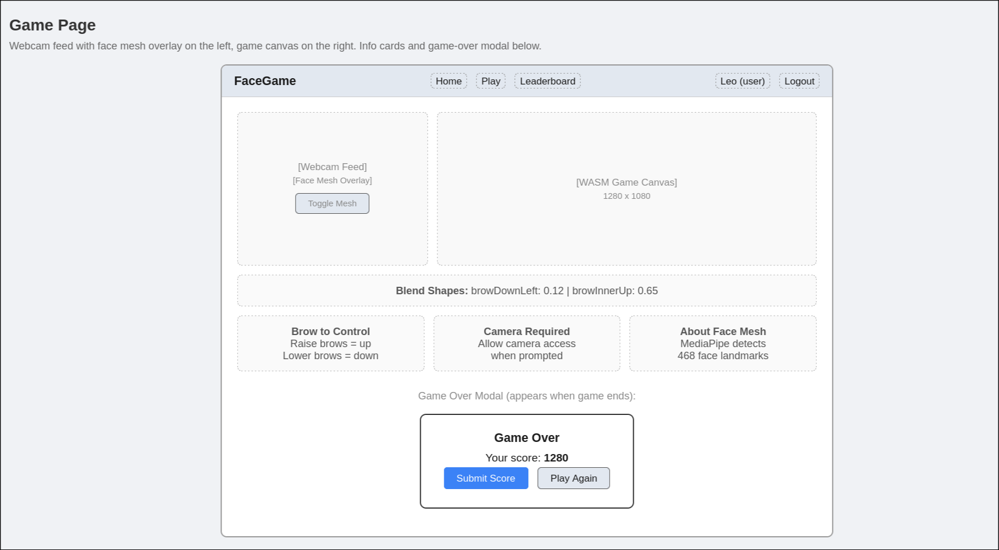
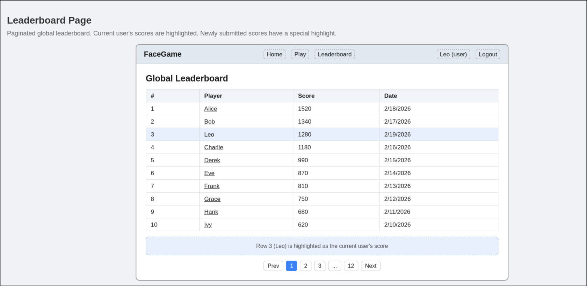
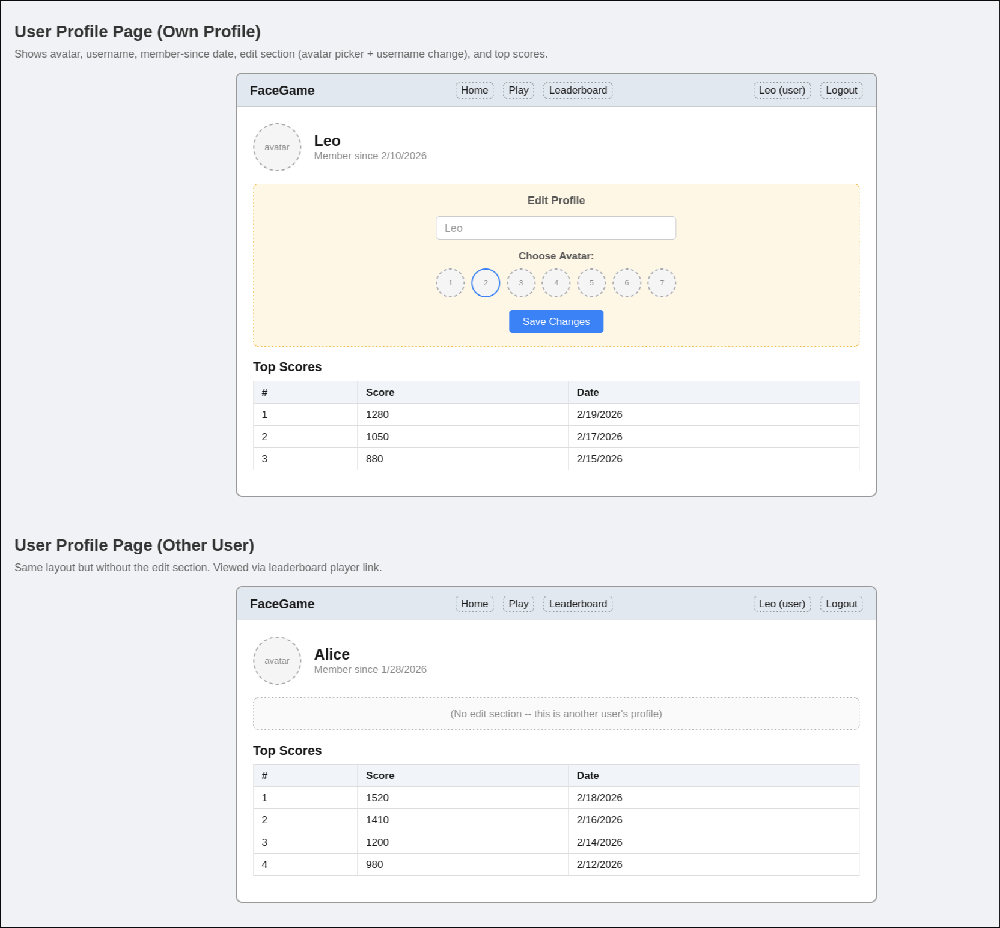

# Design Document

## Project Description

Facial Expression Control Game and Leaderboard is a web platform that serves a Flappy Bird-style game controlled entirely by facial expressions. Instead of tapping a keyboard or screen, players use their webcam and eyebrow movements to control the game character. The platform is built on a deep learning model (MediaPipe FaceLandmarker) packaged as WebAssembly, enabling real-time facial detection directly in the browser with no installation required.

Beyond the game itself, the platform provides a full user account system, a global leaderboard with paginated rankings, and user profiles with customizable avatars. Players can register, compete for high scores, and view each other's profiles and stats.

The project is inspired by [Flappy Bird](https://flappybird.io/) and builds upon a prior prototype at [cs5610 project 1](https://driedyellowpeach.github.io/cs5610-web-dev/project-1-home-page/work.html).

### Key Features

- **Facial expression game control**: Eyebrow movements (raise and lower) are detected via MediaPipe FaceLandmarker in real-time to control game input.
- **WebAssembly game engine**: The Flappy Bird-style game runs as a compiled WASM module for near-native performance in the browser.
- **User authentication**: Registration and login with email validation, bcrypt password hashing, and JWT-based sessions.
- **Global leaderboard**: Paginated ranking of all player scores with highlighting, deep linking, and browser history support.
- **User profiles**: Public profiles showing username, avatar, membership date, and top scores. Users can customize their username and choose from preset avatars.
- **Responsive design**: Mobile-friendly layout with a hamburger navigation menu.

### Technical Stack

| Layer          | Technology                                       |
|----------------|--------------------------------------------------|
| Backend        | Node.js, Express.js                              |
| Database       | MongoDB (native driver, no Mongoose)              |
| Frontend       | Vanilla ES6 JavaScript, HTML5, CSS3               |
| Game Engine    | Rust compiled to WebAssembly                       |
| Face Detection | MediaPipe FaceLandmarker (WASM)                   |
| Authentication | JWT (`jsonwebtoken`), `bcrypt`                    |
| Deployment     | Docker, Render, MongoDB Atlas                      |

---

## User Personas

### 1. Casual Gamer Leo

- **Age**: 21
- **Occupation**: College student
- **Background**: Leo is a sophomore studying computer science. Between classes, he likes quick browser games. He saw a friend share a link to this facial control game and thought it looked hilarious.
- **Goals**:
  - Play a quick, fun game without installing anything
  - Compete with friends by climbing the leaderboard
  - Show off his high score on his profile
- **Frustrations**:
  - Complicated sign-up flows that take too long
  - Games that require downloads or plugins
  - Laggy or unresponsive web apps
- **Tech Comfort**: High -- comfortable with modern browsers, webcam permissions, and web apps.

### 2. Accessibility Enthusiast Maria

- **Age**: 29
- **Occupation**: UX researcher at a tech company
- **Background**: Maria is passionate about alternative input methods and inclusive design. She explores novel interaction patterns and evaluates their usability. She heard about this project as an example of facial-expression-based controls.
- **Goals**:
  - Explore how facial expression controls feel as a game input method
  - Track her improvement over time by reviewing her score history
  - Compare her performance against other players on the leaderboard
- **Frustrations**:
  - Poor webcam compatibility or unclear camera permission prompts
  - No way to see personal score history or progress
  - Cluttered or inaccessible UI
- **Tech Comfort**: High -- experienced with developer tools, WASM, and accessibility standards.

### 3. Competitive Speed-Runner Derek

- **Age**: 25
- **Occupation**: Software engineer and gaming enthusiast
- **Background**: Derek loves competing in niche online games and climbing leaderboards. He discovered this game through a Reddit post and wants to master the facial control mechanic.
- **Goals**:
  - Achieve the top rank on the global leaderboard
  - Fine-tune his eyebrow control for optimal game performance
  - View other top players' profiles and scores
- **Frustrations**:
  - Leaderboard pages that don't paginate or load slowly
  - No way to see where a newly submitted score ranks
  - Lack of player profiles to compare against
- **Tech Comfort**: Very high -- power user who expects fast, responsive web apps.

---

## User Stories

### Authentication

1. **As a new visitor**, I want to register with my email, username, and password so that I can create an account and start tracking my scores.
   - Acceptance: email format is validated, password requires at least 6 characters, duplicate emails/usernames are rejected, and I receive a JWT token upon success.

2. **As a returning player**, I want to log in with my email and password so that I can access my account and submit scores.
   - Acceptance: correct credentials return a JWT token; incorrect credentials show a clear error message.

3. **As a logged-in user**, I want to log out so that my session ends and my account is protected on shared devices.
   - Acceptance: clicking "Logout" clears my token and redirects me to the home page.

### Game

4. **As a player**, I want to play the Flappy Bird-style game directly in my browser using my webcam so that I can enjoy the game without installing anything.
   - Acceptance: the game loads in-browser, requests webcam permission, and responds to my eyebrow movements in real-time.

5. **As a player**, I want to see a real-time face mesh overlay on my webcam feed so that I can verify the game is detecting my face correctly.
   - Acceptance: a toggle button shows/hides the face mesh visualization with colored landmarks for eyebrows, eyes, and lips.

6. **As a player who just finished a game**, I want to see my final score in a game-over modal so that I know how I performed.
   - Acceptance: a modal appears showing my score with options to submit it or play again.

7. **As a logged-in player**, I want to submit my score after a game so that it appears on the global leaderboard.
   - Acceptance: clicking "Submit Score" sends my score to the server and redirects me to the leaderboard page with my new score highlighted.

8. **As a guest player (not logged in)**, I want to still play the game even though I cannot submit scores, so that I can try it out before registering.
   - Acceptance: the game is playable, but the "Submit Score" button is hidden and a message suggests logging in.

### Leaderboard

9. **As a visitor**, I want to see the global leaderboard with paginated scores so that I can browse all player rankings.
   - Acceptance: the leaderboard shows 10 scores per page with Prev/Next buttons and page numbers.

10. **As a logged-in user viewing the leaderboard**, I want my own scores highlighted so that I can quickly find my ranking.
    - Acceptance: rows with my scores have a distinct highlight style.

11. **As a player who just submitted a score**, I want to be redirected to the leaderboard page showing my new score highlighted and scrolled into view.
    - Acceptance: the URL includes `?page=X&highlight=scoreId`, and the page scrolls to and highlights the new score row.

### Profile

12. **As a logged-in user**, I want to view my own profile showing my username, avatar, membership date, and top scores so that I can see my account details.
    - Acceptance: navigating to `/profile.html` (without an ID) shows my own profile with all details.

13. **As a visitor**, I want to view another player's public profile by clicking their name on the leaderboard so that I can see their stats.
    - Acceptance: clicking a player name navigates to `/profile.html?id=<userId>` showing their username, avatar, membership date, and top 10 scores.

14. **As a logged-in user**, I want to change my username and avatar on my profile so that I can personalize my account.
    - Acceptance: an edit section with a username field and avatar picker appears only on my own profile. Saving updates the profile immediately.

### Home

15. **As a visitor**, I want to see the home page with a brief introduction and a preview of the top 5 scores so that I get an overview of the platform.
    - Acceptance: the home page shows a hero section, a "Play Now" button, and a top-5 leaderboard preview with links to the full leaderboard and player profiles.

---

## Design Mockups

See [mockups.html](mockups.html) for visual wireframe mockups of each page. Open the file in a browser to view all page layouts.

### Home Page

### Login / Register Page

### Game Page

### Leaderboard Page

### User Profile Page

